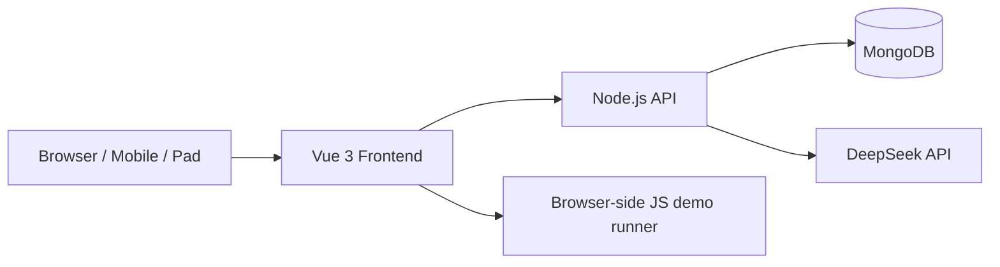

# 面试题仓库 Technical Spec

## 1. 范围说明

本技术方案对应一个内部自用的面试题仓库系统，采用 Vue 3 + Node.js + MongoDB，并通过 Docker Compose 部署。

### 1.1 目标

- 支持账号登录和权限控制。
- 支持题目的创建、编辑、浏览、搜索、筛选和删除。
- 支持纯文本内容展示。
- 支持 AI 辅助生成标签、摘要和难度建议。
- 支持导入、导出和 Docker 部署。
- 支持 PC、Pad 和手机端响应式适配。

### 1.2 非目标

- 不做公开注册。
- 不做审核流和内容版本历史。
- 不做后端在线判题服务。
- 不做多语言执行沙箱。
- 不做复杂推荐系统。

## 2. 技术选型

### 2.1 前端

- Vue 3
- Vite
- TypeScript
- Vue Router
- Pinia
- Element Plus 或同类组件库
- 文本展示组件
- 轻量级代码展示与运行区域

### 2.2 后端

- Node.js
- TypeScript
- Fastify 或 Express
- MongoDB Driver 或 Mongoose
- Zod 或同类校验库
- JWT 登录认证
- Multer 或同类上传库，用于导入文件

### 2.3 数据库

- MongoDB
- 建议为关键字段建立索引：标题、标签、难度、创建人、可见性、更新时间

### 2.4 部署

- Docker
- Docker Compose
- Nginx 反向代理前端和后端
- MongoDB 持久化卷

## 3. 总体架构



### 3.1 模块划分

- Auth 模块：登录、退出、会话管理。
- User 模块：管理员创建成员、停用账号、重置密码。
- Question 模块：题目增删改查。
- Search 模块：关键词搜索和筛选。
- AI 模块：调用 DeepSeek 做摘要、标签和难度建议。
- Import/Export 模块：导入导出题库。
- UI 模块：响应式布局和答案折叠交互。

## 4. 数据模型

### 4.1 User

```ts
{
  _id: string;
  username: string;
  email?: string;
  passwordHash: string;
  role: 'admin' | 'member';
  status: 'active' | 'disabled';
  createdAt: Date;
  updatedAt: Date;
  lastLoginAt?: Date;
}
```

#### 约束

- username 唯一。
- email 可选但如使用则唯一。
- password 仅保存 hash。

### 4.2 Question

```ts
{
  _id: string;
  title: string;
  content: string;
  answer: string;
  tags: string[];
  difficulty: 'easy' | 'medium' | 'hard';
  creatorId: string;
  creatorName: string;
  visibility: 'public' | 'private';
  source?: string;
  aiSummary?: string;
  aiSuggestedTags?: string[];
  aiSuggestedDifficulty?: 'easy' | 'medium' | 'hard';
  createdAt: Date;
  updatedAt: Date;
}
```

#### 约束

- 标题必填。
- 题干和答案使用纯文本。
- 私有题目仅创建者和 admin 可见。
- 不保留版本历史。
- 删除采用硬删除，不提供回收站。

### 4.3 ImportExportJob

如后续需要异步导入导出，可增加任务表；第一版也可以同步完成并跳过该模型。

## 5. 权限设计

### 5.1 角色权限矩阵

| 操作 | admin | member |
| --- | --- | --- |
| 登录 | Yes | Yes |
| 创建账号 | Yes | No |
| 查看公开题目 | Yes | Yes |
| 查看私有题目 | Yes | 仅自己创建的私有题目 |
| 创建题目 | Yes | Yes |
| 编辑自己创建的题目 | Yes | Yes |
| 编辑他人题目 | Yes | No |
| 删除自己创建的题目 | Yes | Yes |
| 删除他人题目 | Yes | No |
| 导入导出 | Yes | Yes |
| AI 辅助 | Yes | Yes |

### 5.2 鉴权方式

- 使用 JWT 作为登录态。
- 前端在请求头中携带 access token。
- 后端通过中间件解析用户身份和角色。
- 管理员接口必须额外校验 role。

## 6. API 设计

### 6.1 Auth

#### POST /api/auth/login

请求：

```json
{
  "username": "alice",
  "password": "123456"
}
```

响应：

```json
{
  "token": "jwt-token",
  "user": {
    "id": "...",
    "username": "alice",
    "role": "member"
  }
}
```

#### POST /api/auth/logout

- 前端清理 token 即可。
- 如后续引入 refresh token，再扩展服务端失效逻辑。

#### GET /api/auth/me

- 返回当前登录用户信息。

### 6.2 Users

#### POST /api/users

- 仅 admin 可用。
- 创建成员账号。

#### GET /api/users

- 仅 admin 可用。
- 用于成员列表和停用管理。

#### PATCH /api/users/:id/status

- 仅 admin 可用。
- active / disabled 切换。

### 6.3 Questions

#### GET /api/questions

查询参数：

- q：关键词。
- tags：标签列表。
- difficulty：难度。
- creatorId：创建人。
- visibility：可见性。
- page：页码。
- pageSize：每页数量。

#### POST /api/questions

- 创建题目。
- 支持同时提交 AI 建议字段，但不强制。

#### GET /api/questions/:id

- 返回题目详情。
- 按可见性和权限做访问控制。

#### PUT /api/questions/:id

- 更新题目。
- 校验编辑权限。

#### DELETE /api/questions/:id

- 硬删除。
- 仅可删除有权限的题目。

### 6.4 AI

#### POST /api/ai/analyze

请求：

```json
{
  "title": "什么是闭包",
  "content": "...",
  "answer": "..."
}
```

响应：

```json
{
  "summary": "...",
  "suggestedTags": ["JS", "作用域"],
  "suggestedDifficulty": "medium"
}
```

### 6.5 Import/Export

#### GET /api/questions/export

- 支持 JSON 导出。
- 可选 CSV 导出。

#### POST /api/questions/import

- 支持 JSON 导入。
- 如果采用 CSV，需要字段映射。
- 导入前做 schema 校验。
- 导入结果返回成功条数和失败条数。

## 7. 搜索与筛选实现

### 7.1 查询能力

- title 和 content 的全文检索。
- tags 精确匹配。
- difficulty 精确匹配。
- creatorId 精确匹配。
- visibility 精确匹配。

### 7.2 索引建议

- title text index。
- content text index。
- tags index。
- difficulty index。
- creatorId index。
- visibility index。
- updatedAt index。

### 7.3 排序

默认按更新时间倒序，必要时可按创建时间倒序。

## 8. 前端页面

### 8.1 页面结构

- 登录页。
- 题目列表页。
- 题目详情页。
- 题目编辑页。
- 管理员用户管理页。
- 导入导出页。

### 8.2 列表交互

- 顶部搜索区放关键词、标签、难度、创建人。
- 列表卡片展示题目标题、标签、难度、创建人和更新时间。
- 默认折叠答案。
- 点击独立按钮展开或收起答案。
- 私有题目明确打标。

### 8.3 响应式策略

- PC：左侧筛选，右侧列表/详情。
- Pad：筛选折叠为抽屉或上方区域。
- 手机：单列卡片，筛选入口折叠为弹出层。

## 9. 文本内容与安全

### 9.1 文本展示

- 后端存普通文本原文。
- 前端统一渲染。
- 渲染前做 XSS 清洗。

### 9.2 输入校验

- 所有写接口做参数校验。
- 文本长度限制。
- 标签数量限制。
- 文件导入做格式和大小限制。

## 10. AI 集成

### 10.1 目标

- 为录题提供标签、摘要、难度建议。
- 不作为保存题目的前置条件。

### 10.2 供应商

- 第一版对接 DeepSeek API。
- API Key 放在环境变量中。

### 10.3 失败处理

- AI 请求失败不阻塞题目保存。
- 前端提示“建议获取失败，可稍后重试”。
- 后端记录错误日志和耗时。

## 11. 浏览器本地 JS 运行

- 仅支持前端本地运行示例代码。
- 不发送到后端执行。
- 仅作为展示或学习辅助，不作为判题系统。
- 运行区域应隔离页面上下文，避免污染主应用状态。

建议实现为：

- 代码编辑区使用轻量编辑器。
- 结果在 iframe 或受控沙箱中展示。
- 超时和错误需要前端捕获。

## 12. Docker 部署

### 12.1 服务划分

- web：前端静态资源。
- api：Node.js 后端服务。
- mongo：数据库。
- nginx：统一入口和反向代理。

### 12.2 环境变量

- MONGO_URI
- JWT_SECRET
- DEEPSEEK_API_KEY
- DEEPSEEK_BASE_URL
- ADMIN_SEED_USERNAME
- ADMIN_SEED_PASSWORD

### 12.3 启动顺序

1. MongoDB 启动并完成初始化。
2. 后端执行建表或初始化脚本。
3. 后端创建默认管理员账号。
4. 前端与 Nginx 对外提供访问。

## 13. 目录建议

```text
project/
  frontend/
  backend/
  docker/
  docs/
```

## 14. 非功能需求

- 可用性：适合小团队稳定使用。
- 性能：列表查询和搜索需在可接受时间内返回。
- 可维护性：模块边界清晰，方便后续扩展题单、收藏和历史记录。
- 可部署性：docker-compose 一键启动。

## 15. 测试建议

- 登录和权限测试。
- 题目增删改查测试。
- 搜索与筛选测试。
- 导入导出测试。
- AI 失败降级测试。
- 移动端响应式测试。
- 文本展示与转义测试。

## 16. 后续可扩展项

- 收藏题目。
- 题单。
- 编辑历史。
- 回收站。
- 更细粒度权限。
- 多 AI 供应商支持。
